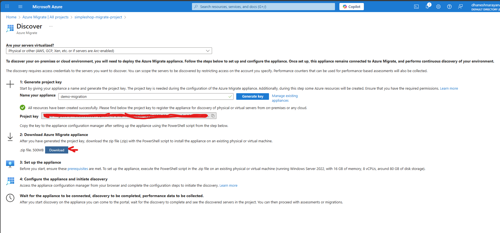
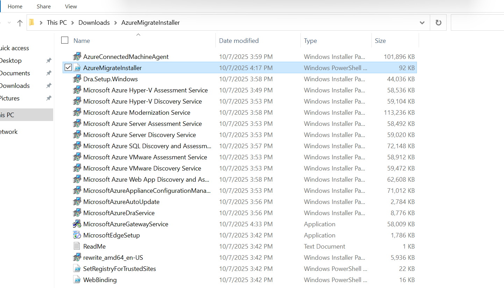
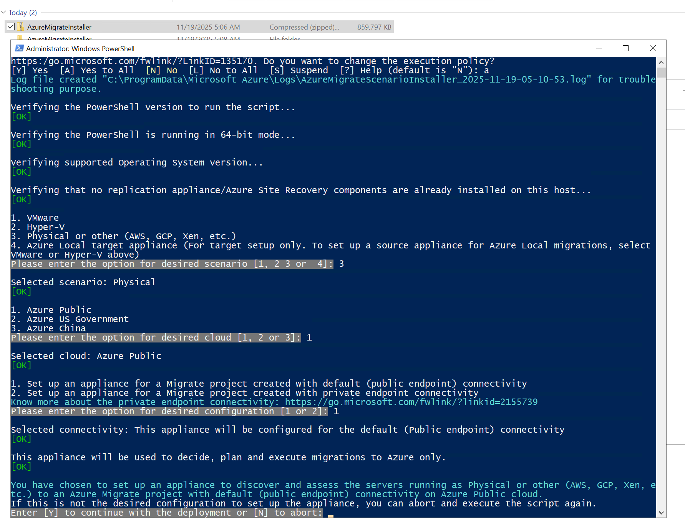
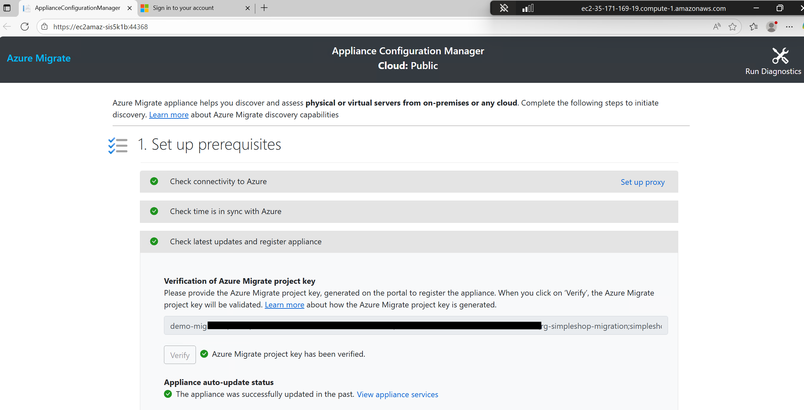
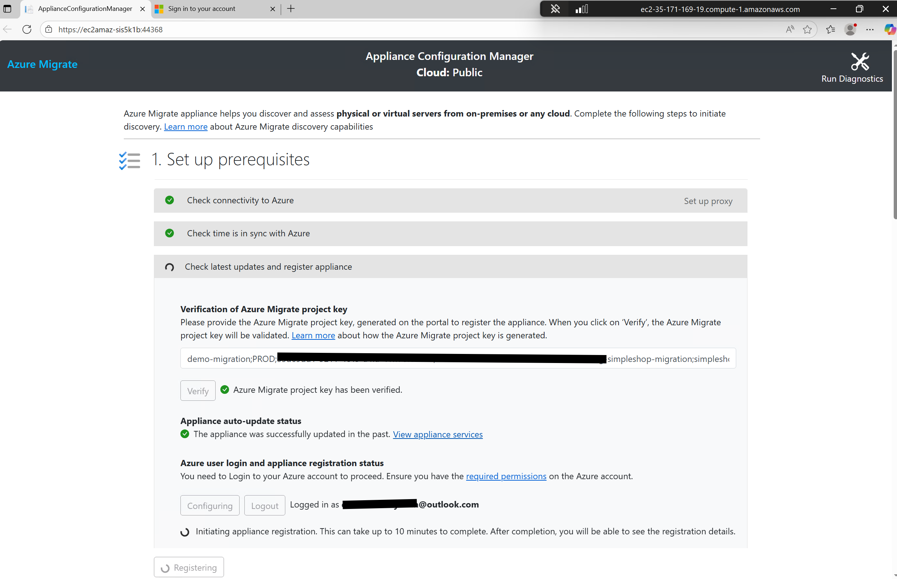

# SimpleShop AWS → Azure Migration Lab – Azure Migration Guide

This document describes how to use **Azure Migrate** to discover, assess, and migrate the SimpleShop EC2 VM from AWS to an Azure VM. It is designed for a ~1 hour demo, assuming the AWS environment is already prepared (see `02-aws-preparation.md`).

> For the live demo, you should have **discovery and assessment already completed** to save time. You can walk through the steps and show the final results, then optionally kick off a test migration.

---

## 1. Prerequisites

Before using Azure Migrate, ensure you have:

- An **Azure subscription** with permissions to create:
  - Resource groups
  - Azure Migrate projects
  - Azure VMs, VNets, storage accounts
- A designated **Azure region** (e.g., `East US`) for migration.
- Access to the **AWS environment** and the ability to deploy the Azure Migrate appliance VM into AWS.
- Network connectivity from the Azure Migrate appliance to:
  - The EC2 instance (for agentless discovery) or
  - The vCenter/hosts you want to inventory (if using VMware; not needed here).

> This guide focuses on **agentless discovery and migration of the EC2 VM** where supported. You can also use agent-based methods depending on your scenario.

---

## 2. High-level migration workflow

At a high level, the migration flow is:

1. **Create an Azure Migrate project** in the Azure portal.
2. **Deploy the Azure Migrate appliance** into the AWS environment.
3. **Discover the EC2 VM** (SimpleShop) using the appliance.
4. **Assess** the discovered VM.
5. **Replicate and migrate** the VM to Azure.
6. **Validate** the migrated VM and SimpleShop app on Azure.

For a 1-hour demo, you should complete steps 1–4 ahead of time and show results. Steps 5–6 can be partly live.

---

## 2a. Quick execution checklist for this lab

Use this as your runbook when you are ready to move the freshly hardened nginx VM:

1. **Azure side prep (do once)**
   - Resource group: `rg-simpleshop-migration`.
   - VNet/subnet: `vnet-simpleshop` with `subnet-app` (any `/24` works if it doesn't overlap with AWS VPC).
   - Optional NSG `nsg-simpleshop-app` allowing inbound HTTP (80) and SSH/RDP from your IP for validation.
2. **Create/confirm Azure Migrate project**
   - Portal → Azure Migrate → **Servers, databases and web apps** → **Create project** (name `simpleshop-migrate-project`).
   - Note the region and project key; you’ll use it on the appliance.
3. **Deploy Azure Migrate appliance into AWS**
   - Launch a Windows Server 2019 (recommended) or Ubuntu VM in the same VPC/subnet as `aws_instance.web`.
   - Allow outbound HTTPS (443) to Azure and inbound RDP/SSH from your IP.
   - Download/run the **AzureMigrateInstaller.ps1** (or Linux script) using the portal instructions, then register with the project key.
4. **Scope discovery to the SimpleShop EC2**
   - Provide AWS credentials limited to DescribeInstances for the lab account, or manually input the EC2 host IP.
   - Let discovery run until the `simpleshop-web` VM shows up under **Servers discovered**.
5. **Create assessment**
   - Assessment name `simpleshop-web-assessment`, target region `East US`, sizing = performance-based, preferred size family = `Dsv3`.
   - Capture readiness/cost screenshots for your deck.
6. **Enable replication**
   - Source: **Appliance discovered** → select `simpleshop-web`.
   - Target resource group/VNet: use the ones above; pick Availability Zone 1 and accept the recommended VM size (~`Standard D2s v3`).
   - Keep OS disk + any data disks checked, then **Start replication**.
7. **Test migrate**
   - After initial sync, run **Test migrate** into `vnet-simpleshop/subnet-app`.
   - When VM is up, browse `http://<test-vm-public-ip>` and verify the SimpleShop landing page rendered from `/var/www/simpleshop`.
8. **Full migrate (cutover)**
   - When ready, stop nginx on AWS (optional), then choose **Migrate** in Azure Migrate to create the production Azure VM.
   - Update DNS (if any) to point to the Azure public IP.

The rest of this document expands on each step with screenshots and talking points for the 1-hour session.

---

## 3. Create Azure Migrate project

1. Sign in to the **Azure portal**.
2. In the search bar, type **"Azure Migrate"** and open **Azure Migrate**.
3. Under **Servers, databases and web apps**, select **Discover**.
4. If you don't already have a project, select **Create project** and enter:
   - Subscription: your subscription.
   - Resource group: e.g., `rg-simpleshop-migration`.
   - Project name: e.g., `simpleshop-migrate-project`.
   - Geography: choose the geography closest to your source/target.
5. Click **Create**.

After creation, you will land on the **Migrate project overview** page.

---

## 4. Configure discovery of AWS VMs

> Discovery is done via an **Azure Migrate appliance** deployed into AWS. For the live demo, have this appliance already deployed and discovery completed.

### 4.1 Start discovery setup in Azure

1. In your Azure Migrate project, go to **Servers, databases and web apps**.
2. Under **Discover**, click **Discover**.
3. For **Are your machines virtualized?**, choose **Yes, with Hyper-V/VMware** or **No** depending on your environment. For EC2, you will typically use **No** or a scenario that supports discovery of physical/other servers.
4. Choose the appropriate discovery option for **other** or **AWS** servers according to the latest Azure Migrate guidance (the portal will walk you through it).
5. Azure Migrate will prompt you to **Download the Azure Migrate appliance** and provide a **key** to register it.

### 4.2 Deploy the appliance in AWS

From your AWS side:

1. Deploy a new VM in the same VPC as the SimpleShop EC2 instance.
   - OS: per Azure Migrate appliance requirements (often OVA/VM image for VMware, or a script to set up on a Windows Server VM). Follow the current Azure docs.
2. Ensure the appliance VM can:
   - Reach the SimpleShop EC2 instance over the network.
   - Reach the Azure Migrate service endpoints over the internet.
3. On the appliance VM, complete the **initial configuration**:
   - Provide the **project key** downloaded from the Azure portal.
   - Configure discovery scope (AWS account/VMs to scan).

> For the lab, you can restrict discovery to a **single EC2 instance** to keep the inventory small and clear.

#### 4.2.1 Detailed AWS deployment steps

1. **Launch an appliance VM**
   - AMI: *Windows Server 2019/2022 Base* (recommended) or *Ubuntu 22.04* if you prefer the Linux installer.
   - Instance size: `t3.large` (2 vCPU, 8 GB RAM) meets Azure Migrate requirements.
   - Storage: 128‑GB gp3 root volume for metadata cache.
   - Network: Same VPC/subnet as `aws_instance.web`; associate a security group that allows inbound RDP (3389) or SSH (22) from your IP and outbound HTTPS (443) to the internet/Azure endpoints.

2. **Open the Azure portal and download the installer**
   - In Azure Migrate → **Servers, databases and web apps**, click **Discover** → **Download** to get `AzureMigrateInstaller.ps1` plus the **project key**.


   - Copy both to the helper VM (via RDP copy/paste or `Invoke-WebRequest`).

3. **Install the appliance software (Windows example)**
   - On the helper VM, run the following as Administrator:

     ```powershell
     Set-ExecutionPolicy Bypass -Scope Process -Force
     .\AzureMigrateInstaller.ps1
     ```

   - Accept defaults to extract to `C:\AzureMigrate` and let the script install required roles (IIS, .NET, URL Rewrite, etc.).
   

4. **Run Configuration Manager**
   - Launch the **Azure Migrate Appliance Configuration Manager** shortcut (opens `https://localhost:44368`).
   - Paste the **project key** you recorded; this registers the appliance with Azure.
   - Complete prerequisite checks (time sync, connectivity, updates). Resolve any warnings shown.
   
   

5. **Provide AWS discovery credentials**
   - In Configuration Manager → **Provide credentials**, add an IAM user/role with `AmazonEC2ReadOnlyAccess` (Describe* permissions are sufficient).
   - Enter Access Key ID + Secret. Optionally restrict scope to the SimpleShop account/VPC.

6. **Start discovery**
   - Specify the region(s) or instance IDs to crawl (add the `simpleshop-web` instance ID for a tight lab scope).
   - Click **Start discovery**; leave the VM running until the status flips to **Discovery completed**.

7. **Verify connectivity from Azure**
   - Back in the Azure portal, refresh **Servers discovered**. You should see `simpleshop-web` with hardware inventory.
   - The appliance tile should read **Connected**. If not, re-open Configuration Manager and rerun the checks.

8. **Optional hardening**
   - Restrict the security group to Azure public IP ranges only once discovery is stable.
   - Tag the appliance VM (e.g., `Purpose=AzureMigrate`) so it’s easy to remove after migration.

### 4.3 Verify discovery in Azure

After the appliance has run discovery for some time:

1. Go back to the **Azure Migrate project**.
2. Under **Servers, databases and web apps → Discovered servers**, you should see your EC2 instance, e.g., `simpleshop-web`.
3. Confirm inventory details such as:
   - OS type and version.
   - CPU, memory, disk sizes.
   - Network details.

Take screenshots or note this view for your demo.

---

## 5. Assess the SimpleShop EC2 VM

1. In the Azure Migrate project, go to **Servers, databases and web apps**.
2. Under **Assessment tools**, ensure **Azure Migrate: Discovery and assessment** is enabled.
3. Create an assessment:
   - Click **Assess**.
   - Select the discovered server(s), including `simpleshop-web`.
   - Specify:
     - Target location (e.g., `East US`).
     - Sizing criteria (performance-based or as-on-premises).
     - VM series preferences (e.g., `Dsv3` series).
   - Create the assessment.
4. Once assessment is complete, open it and review:
   - **Readiness**: Whether the VM is ready to migrate.
   - **Recommended Azure VM size**.
   - **Monthly cost estimate**.

For the demo, you can briefly show this assessment and highlight how Azure Migrate helps with right-sizing and cost estimation.

---

## 6. Prepare Azure target resources (network, resource group)

Before starting migration, set up the basic target infrastructure:

1. **Resource group**:
   - Create (if not already done) `rg-simpleshop-migration`.
2. **Virtual Network**:
   - Create a VNet (e.g., `vnet-simpleshop`) in your target region.
   - Add at least one subnet (e.g., `subnet-app`).
3. (Optional) **Network Security Group**:
   - Create an NSG (e.g., `nsg-simpleshop-app`).
   - Add inbound rules:
     - Allow HTTP (80) from `Internet` for demo.
     - (Optionally) Allow SSH (22) from your IP.

You can create these in advance and simply reference them during migration.

---

## 7. Replicate and migrate the EC2 VM

> For the best demo experience, have a **test migration** already completed before the session. You can show the process and the existing result, and optionally trigger another test migration.

### 7.1 Enable replication

1. In the Azure Migrate project, go to **Servers, databases and web apps**.
2. Under **Azure Migrate: Server Migration**, select **Replicate**.
3. Source settings:
   - Specify the source as **Servers discovered from Azure Migrate appliance**.
   - Choose the appropriate discovery source (the appliance you configured for AWS).
4. Virtual machines:
   - Select the `simpleshop-web` EC2 instance.
5. Target settings:
   - Subscription: your subscription.
   - Resource group: `rg-simpleshop-migration`.
   - Region: target region (e.g., `East US`).
   - Availability options: as per your needs (e.g., Availability zone or no redundancy for demo).
   - VNet: `vnet-simpleshop`.
   - Subnet: `subnet-app`.
6. Compute settings:
   - Review and adjust the **Azure VM size** (or accept recommended size).
   - Set OS disk and data disk configurations as needed.
7. Disks:
   - Confirm which disks to replicate (usually the OS disk, plus any data disks if present).
8. Start replication.

Replication may take some time, depending on disk size and network bandwidth. Perform this in advance for a smooth demo.

### 7.2 Perform a test migration

Once replication is complete:

1. In **Azure Migrate: Server Migration**, locate the `simpleshop-web` VM.
2. Select **Test migrate**.
3. Choose:
   - Azure VNet: `vnet-simpleshop`.
4. Azure Migrate creates a **test Azure VM** (e.g., with `-test` suffix).
5. After the test VM is running:
   - Go to **Azure Portal → Virtual Machines**.
   - Locate the test VM.
   - Note the **public IP** or DNS name.

For your demo, you can:

- Show the test VM in the portal.
- Optionally RDP/SSH into it (depending on OS) to show that the file system and app stack are present.
- Hit the SimpleShop application via browser once you have configured it (see next section).

### 7.3 Perform a full migration (cutover)

After testing, you can perform a full migration (outside demo time) or explain the steps:

1. In **Azure Migrate: Server Migration**, select the replicated `simpleshop-web`.
2. Choose **Migrate** (not "Test migrate").
3. Confirm shutdown options and start migration.
4. Once complete, the production Azure VM is created and the on-prem/AWS VM is typically stopped (depending on your strategy).

For your 1-hour session, you can focus on **test migration** and explain that full migration follows the same pattern with cutover planning.

---

## 8. Validate the migrated VM and SimpleShop app in Azure

After a test or full migration, validate that the SimpleShop app runs correctly on Azure.

### 8.1 Confirm VM status and network

1. In the Azure portal, go to **Virtual Machines**.
2. Select the migrated (or test) VM.
3. Check:
   - **Status**: `Running`.
   - **Networking**:
     - Public IP assigned (if configured).
     - NSG rules allow HTTP (80) from the internet.

### 8.2 Access the SimpleShop application

1. From your browser, navigate to:

   ```text
   http://<Migrated-VM-Public-IP>/
   ```

2. Confirm that:
   - The SimpleShop homepage loads.
   - You can view products.
   - You can create orders (if database connectivity is preserved).

> If the database is still on RDS, make sure the migrated VM can reach RDS over the network. For a real migration, you would typically also migrate the DB using Azure Database Migration Service and update the app connection string to point to Azure Database.

### 8.3 (Optional) Show SSH / RDP access

- Connect to the Azure VM via SSH/RDP and show:
  - The same files and app structure as on the EC2 instance.
  - Any changes you may have made to mark that it is "running on Azure" (e.g., environment variable and banner in UI).

---

## 9. Database migration (optional, conceptual or hands-on)

If time permits, you can highlight or demo database migration using **Azure Database Migration Service (DMS)**.

### 9.1 Conceptual overview (good for tight 1-hour slot)

Explain:

1. Provision **Azure Database for MySQL/PostgreSQL** in the same region as the VM.
2. Use **Azure Database Migration Service** to:
   - Connect to source (RDS) and target (Azure DB).
   - Select the `simpleshop` database and tables.
   - Migrate schema and data.
3. Update the SimpleShop app connection string on the Azure VM to point to the new Azure Database endpoint.
4. Restart the app and verify it now reads/writes to Azure DB.

### 9.2 Optional hands-on steps (for extended labs)

For a longer workshop, you can provide a separate detailed DMS walkthrough.

---

## 10. Suggested 1-hour demo flow using this guide

Use this sequence for your live session:

1. **(5–10 min) Show AWS source environment**
   - EC2 instance running SimpleShop.
   - RDS database behind it.
   - Live app demo: list products, create an order.

2. **(15–20 min) Walk through Azure Migrate project**
   - Show project, discovered `simpleshop-web` VM.
   - Show an existing assessment: sizing, readiness, costs.

3. **(15–20 min) Demonstrate migration**
   - Show replication status (preconfigured).
   - If possible, initiate a **Test migrate** and describe what happens.
   - Show the already-created test VM in Azure.

4. **(10–15 min) Validate and compare**
   - Browse to SimpleShop on the migrated Azure VM.
   - Call out similarities and differences vs AWS.
   - Briefly describe next steps for DB migration and optimization.

This guide gives you all the steps you need to prepare ahead of time and confidently walk through the migration flow during your 1-hour demo.
